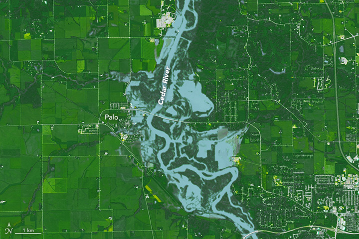

## Background

<center>

</center>


On September 26, 2016 at 11:47 a.m. U.S. Central Daylight Time (16:47 UTC) the Cedar and Wapsipinicon rivers in Iowa surged producing a flood wave that breached the river banks. The water level of the Cedar River measured ~20 feet — 8 feet above flood stage—near the city of Cedar Rapids.

The water level continued to rise until it peaked at ~22 feet on September 27. This event had only been exceeded once, in June 2008, when thousands of people were encouraged to evacuate from Cedar Rapids, the second-most-populous city in Iowa.

The goal of this lab is to investigate the impacts in Palo, Iowa because it is up stream of Cedar Rapids, contains a large amount of farm land, and does not have a forecast location to provide warning.

The raster package and an understanding of raster data,and categorization to create flood images using mutliband Landsat Imagery, thresholding, and classification methods will all be employed.

### Libraries
```{r, warning=FALSE, message=FALSE}
# SPDS
library(tidyverse)
library(sf)
library(units)
library(raster)

library(getlandsat)
library(mapview)
library(osmdata)
```

## Part 1
First, we need to identify an AOI. We want to be able to extract the flood extents for Palo, Iowa and its surroundings.
```{r, warning=FALSE, message=FALSE}
bb = read_csv("../data/uscities.csv") %>%
  filter(city == "Palo") %>%
  st_as_sf(coords = c("lng", "lat"), crs = 4326) %>%
  st_transform(5070) %>%
  st_buffer(5000) %>%
  st_bbox() %>%
  st_as_sfc() %>%
  st_as_sf()

bbwgs = bb %>% st_transform(4326)
```

## Part 2
In an R script, data from the Landsat satellites was downloaded using getlandsat::lsat_scenes(). The scenes were then filtered to the AOI and date of interest (2016-09-26), and written to a csv file to reduce computing power required in this rmd file. 

#### 2.2 Find files to download/cache
```{r, warning=FALSE, message=FALSE}
meta = read_csv("../data/palo-flood-scene.csv")

files = lsat_scene_files(meta$download_url) %>% 
  filter(grepl(paste0("B", 1:6, ".TIF$", collapse = "|"), file)) %>% 
  arrange(file) %>% 
  pull(file)
```

#### 2.3 Download files to cache location
```{r, warning=FALSE, message=FALSE}
st = sapply(files, lsat_image)
b = stack(st) %>% 
  setNames(c(paste0("band", 1:6)))
```
This creates a stacked image of the 6 layers with dimensions of 7811 x 7681. The CRS is WGS84 (with a projection system of UTM Zone 15), and the cell resolution is 30m. 

#### 2.4 Analyze image for the regions surrounding the AOI (Palo)
Need to crop the LandSAT raster to the extent of the defined AOI. 
```{r, warning=FALSE, message=FALSE}
cropper = bbwgs %>% 
  st_transform(crs(b))

r = crop(b, cropper)
```
This new cropped image stack still has 6 layers, but reduced dimensions of 340 x 346. The projection system, coordinate reference system, and cell resolution are the same as the raster stack in part 2.3. 

## Part 3
The required images have been identified, downloaded, and cached. They were then loaded as a multiband raster object in R, and cropped to the extent of the AOI. 

#### 3.1 Loading different combinations into RGB channels
Standard cameras replicate whats seen with the human eye, by capturing light in the red, green and blue wavelengths and applying red, green ,and blue filters (channels) to generate a natural looking RGB image.

With a multispectral Landsat 8 image, we have more information to work with and different wavelengths/combinations can help isolate particular features.

For example, the Near Infrared (NIR) wavelength is commonly used to analyze vegetation health because vegetation reflects strongly in this portion of the electromagnetic spectrum. Alternatively, the Shortwave Infrared (SWIR) bands are useful for discerning what is wet and dry.

When working with Landsat imagery, a logical first step is to load an image into an image analysis program (like ENVI) to visualize whats in the scene. We can do the same thing with R using the plotRGB function and selecting which band should populate each channel.

First we loaded different combinations into the RGB channels to show how these can make different features stand out. A reference for popular band combinations can be found [here](https://www.l3harrisgeospatial.com/Learn/Blogs/Blog-Details/ArtMID/10198/ArticleID/15691/The-Many-Band-Combinations-of-Landsat-8), but for this lab I just made four unique combinations:

- R-G-B (natural color)
- NIR-R-G (fa) (color infared)
- NIR-SWIR1-R (false color water focus)
- Additional combination of choice:
  - SWIR1-NIR-B (false color agriculture focus)
  
R-G-B (natural color)
```{r, warning=FALSE, message=FALSE}
plotRGB(r, r = 4, g = 3, b = 2)
```

NIR-R-G (fa) (color infared)
```{r, warning=FALSE, message=FALSE}
plotRGB(r, r = 5, g = 4, b = 3)
```
This plot starts to pull out vegetation (or any surface that photosynthesizes or releases some amount of water) - this results from the use of the NIR band. 

NIR-SWIR1-R (false color water focus)
```{r, warning=FALSE, message=FALSE}
plotRGB(r, r = 5, g = 6, b = 4)
```

SWIR1-NIR-B (false color agriculture focus)
```{r, warning=FALSE, message=FALSE}
plotRGB(r, r = 6, g = 5, b = 2)
```

RGB image comparison:
```{r, warning=FALSE, message=FALSE}
par(mfrow = c(2,2))
plotRGB(r, r = 4, g = 3, b = 2)
plotRGB(r, r = 5, g = 4, b = 3)
plotRGB(r, r = 5, g = 6, b = 4)
plotRGB(r, r = 6, g = 5, b = 2)
```

#### 3.2 Apply stretch to improve clarity/contrast
Color stretches are used to increase the contrast of an image, and thereby improve the clarity. By 'stretching' the range of values available, the variability is reduced and various features become more easily defined. The stretch function replaces the minimum RGB value so that rather than the minimum **possible** value being used, the minimum value that exists in the image is used. The same treatment occurs for the maximum value. 

stretch = "hist" uses a histogram of the available values
stretch = "lin" is simply a slightly different way of stretching the values in an image

Stretching an image does not change the data. It is just a visual tool that can be helpful for analysis. 

RGB image comparison w stretch="hist"
```{r, warning=FALSE, message=FALSE}
par(mfrow = c(2,2))
plotRGB(r, r = 4, g = 3, b = 2, stretch = "hist")
plotRGB(r, r = 5, g = 4, b = 3, stretch = "hist")
plotRGB(r, r = 5, g = 6, b = 4, stretch = "hist")
plotRGB(r, r = 6, g = 5, b = 2, stretch = "hist")
```

RGB image comparison w stretch="lin"
```{r, warning=FALSE, message=FALSE}
par(mfrow = c(2,2))
plotRGB(r, r = 4, g = 3, b = 2, stretch = "lin")
plotRGB(r, r = 5, g = 4, b = 3, stretch = "lin")
plotRGB(r, r = 5, g = 6, b = 4, stretch = "lin")
plotRGB(r, r = 6, g = 5, b = 2, stretch = "lin")
```

## Part 4
Accurate assessment of surface water features (like flooding) have been made possible by remote sensing technology. Index methods are commonly used for surface water estimation using a threshold value.

For this lab we will look at 5 unique thresholding methods for delineating surface water features from different combinations of Landsat bands:

- Normalized difference vegetation index (NDVI)
- Normalized difference water index (NDWI)
- Modified normalized difference water index (MNDWI)
- Water ratio index (WRI)
- Simple water index (SWI)

#### 4.1 Raster algebra

- Create 5 new rasters using the formulas for NDVI, NDWI, MNDWI, WRI and SWI
- Combine those new rasters into a stacked object
- Set the names of your new stack to useful values
- Plot the new stack
```{r, warning=FALSE, message=FALSE}
#Normalized difference vegetation index
ndvi = (r$band5 - r$band4) / (r$band5 + r$band4)
plot(ndvi)

#Use specified color palette
palette = colorRampPalette(c("blue", "white", "red"))
plot(ndvi, col = palette(256))

#Normalized difference water index 
ndwi = (r$band3 - r$band5) / (r$band3 + r$band5)
plot(ndwi, col = palette(256))

#Modified normalized difference water index
mndwi = (r$band3 - r$band6) / (r$band3 + r$band6)
plot(mndwi, col = palette(256))

#Water ratio index
wri = (r$band3 + r$band4) / (r$band5 + r$band6)
plot(wri, col = palette(256))

#Simple water index 
swi = 1/(sqrt(r$band2 - r$band6))
plot(swi, col = palette(256))

swf = stack(ndvi, ndwi, mndwi, wri, swi) %>% 
  setNames(c("ndvi", "ndwi", "mndwi", "wri", "swi"))
plot(swf, col = palette(256))
```
The images all highlight the water features in the AOI (mainly featured on the right hand side of the area in question). The ndvi and swi plots both characterize cells with water as low values, while the other three plots assign high values to cells associated with water. The mndwi plot has the largest extremes, with cells associated with water assigned high values and nearly everything else assigned low values. This contrasts greatly to the effect that is achieved in the ndwi and swi plots, where more mid-range values are present, as illustrated by the increased density of white cells. 
#### 4.2 Raster thresholding
Here we will extract the flood extents from each of the above rasters using the thresholds defined below:

- NDVI: Cells less then 0
- NDWI: Cells greater then 0
- MNDWI: Cells greater then 0
- WRI: Cells greater then 1
- SWI: Cells less then 5

For this, we will use the calc function and apply a custom formula for each calculated field from step 1 that applies the threshold in a way that flooded cells are 1 and non-flooded cells are 0.
```{r, warning=FALSE, message=FALSE}
thresh_ndvi = function(x){ifelse(x <= 0, 1, 0)}
flood_ndvi = calc(ndvi, thresh_ndvi)

thresh_ndwi = function(x){ifelse(x >= 0, 1, 0)}
flood_ndwi = calc(ndwi, thresh_ndwi)

#The same function can be used here because the threshold is the same
flood_mndwi = calc(mndwi, thresh_ndwi)

thresh_wri = function(x){ifelse(x >= 1, 1, 0)}
flood_wri = calc(wri, thresh_wri)

thresh_swi = function(x){ifelse(x <= 5, 1, 0)}
flood_swi = calc(swi, thresh_swi)
```

Once completed, stack the binary ([0,1]) files into a new stack, set the names to meaningful descriptions, and plot the stack so that floods are blue, and background is white.
```{r, warning=FALSE, message=FALSE}
floods = stack(flood_ndvi, flood_ndwi, flood_mndwi, flood_wri, flood_swi) %>% 
  setNames(c("ndvi", "ndwi", "mndwi", "wri", "swi"))

palette2 = colorRampPalette(c("white", "blue"))
plot(floods, col = palette2(2))

#plot(floods, colorRamp(c("white", "blue"))(2))
#plot(floods, colorRampPalette(c("white", "blue")))
#plot(floods, colorRampPalette(c("white", "blue"))(2))
#plot(floods, col = (c(scale_color_gradient(low = "white", high = "blue"))))
```
Confirm there are no missing values in the data.
```{r, warning=FALSE, message=FALSE}
floods <- na.omit(floods)
```

## Part 5
An alternative way to identify similar features in a continuous field is through supervised or unsupervised classification. Supervised classification groups values (cells) based on user supplied “truth” locations. Since flood events are fast-occurring there is rarely truth points for a live event. Instead developers rely on libraries of flood spectral signatures.

Unsupervised classification finds statistically significant groupings within the data. In these clustering algorithms, the user specifies the number of classes and the categorization is created based on the patterns in the data.

For this lab we will use a simple k-means algorithm to group raster cells with similar spectral properties.   

#### 5.1 Set seed
Anytime we want to be able to produce a consistent/reproducible result from a random process in R we need to set a seed. 
```{r, warning=FALSE, message=FALSE}
set.seed(09072020)
```

#### 5.2 Extract values
```{r, warning=FALSE, message=FALSE}
getValues(b) %>% 
  dim()
```
This shows that there are 59996291 values in each of the  6layers. 


```{r, warning=FALSE, message=FALSE}
r2 = stack(st) %>% 
  setNames(c(paste0("band", 1:6))) %>% 
  crop(cropper) %>% 
  stack()
#the getValues function wasn't working with the object r, I think maybe because it's a RasterBrick
  
vals = getValues(r2) %>% 
  na.omit()
vs = scale(vals)

k12 = kmeans(vs, 12, iter.max = 100)

kmeans_raster = floods$ndvi
values(kmeans_raster) = k12$cluster
plot(kmeans_raster)

k9 = kmeans(vs, 9, iter.max = 100)
kmeans_raster = floods$ndvi
values(kmeans_raster) = k9$cluster
plot(kmeans_raster)

k6 = kmeans(vs, 6, iter.max = 100)
kmeans_raster = floods$ndvi
values(kmeans_raster) = k6$cluster
plot(kmeans_raster)

k3 = kmeans(vs, 3, iter.max = 100)
kmeans_raster = floods$ndvi
values(kmeans_raster) = k3$cluster
plot(kmeans_raster)

k7 = kmeans(vs, 7, iter.max = 100)
kmeans_raster = floods$ndvi
values(kmeans_raster) = k7$cluster
plot(kmeans_raster)
```

#### 5.3 Identify the flood category programatically
```{r, warning=FALSE, message=FALSE}
kmeans_vals = getValues(kmeans_raster)
binary_vals = getValues(flood_ndvi)
table <- table(binary_vals,kmeans_vals)
table

which.max(table[2,])
#This indicates the cluster in the kmeans data that coincides with the most flooded cells in the binary mask.

thresh_kmeans = function(x){ifelse(x == 3, 1, 0)}
flood_kmeans = calc(kmeans_raster, thresh_kmeans)
plot(flood_kmeans, col = palette2(2))

floods = addLayer(floods, flood_kmeans) %>% 
    setNames(c("ndvi", "ndwi", "mndwi", "wri", "swi", "kmeans"))
```
## Part 6
Identify how the 6 different methods for creating a flood raster compare. 
```{r, warning=FALSE, message=FALSE}
c1 = cellStats(floods$ndvi, stat = 'sum')*30^2
c2 = cellStats(floods$ndwi, stat = 'sum')*30^2
c3 = cellStats(floods$mndwi, stat = 'sum')*30^2
c4 = cellStats(floods$wri, stat = 'sum')*30^2
c5 = cellStats(floods$swi, stat = 'sum')*30^2
c6 = cellStats(floods$kmeans, stat = 'sum')*30^2

compare_df <- c("NDVI", c1,
                "NDWI", c2,
                "MNDWI", c3,
                "WRI", c4,
                "SWI", c5,
                "Kmeans", c6)
compare_m <- matrix(compare_df,
                ncol = 2,
                byrow = TRUE)

compare_m %>% 
  knitr::kable(caption = "Number of Flooded Cells from 6 Different Flood Rasters",
               format.args = list(big.mark = ",")) %>%
  kableExtra::kable_styling("bordered", full_width = T, font_size = 14)

flood_total = calc(floods, sum) 
plot(flood_total, col = palette2(6))

map_na = function(x){ifelse(x == 0, NA, 1)}
map_raster = calc(flood_total, map_na)

map_raster = map_raster*flood_total
mapview(map_raster)
```

## Extra Credit
```{r, warning=FALSE, message=FALSE}
pt1 = st_point(c(-91.78948,42.06306)) %>% 
  st_sfc() %>% 
  st_as_sf(coords = -91.78948,42.06306, crs = 4326) %>% 
  st_transform(crs(flood_total)) 

raster::extract(flood_total, pt1)
```
Five of the six maps captured flooding at this location. 


