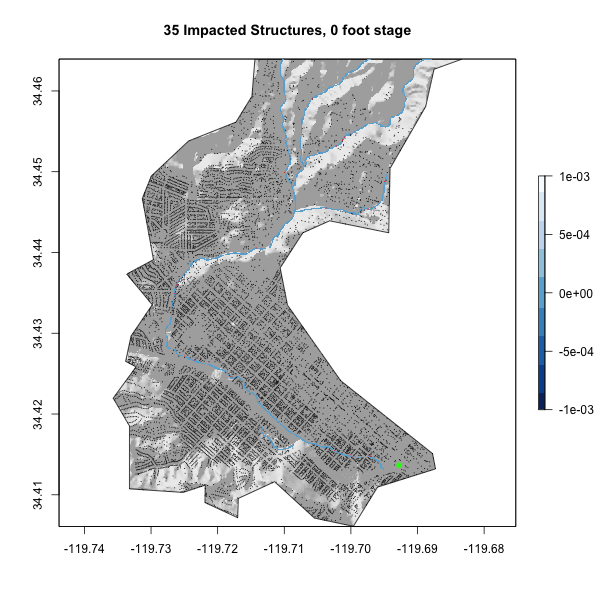

```{r setup, include=FALSE}
knitr::opts_chunk$set(warning = FALSE, message = FALSE, fig.align = 'center')
```


### Libraries
```{r}
library(sf)        # vector manipulation
library(raster)    # raster manipulation
library(fasterize) # "faster" raster
library(whitebox)  # terrain analysis
library(tidyverse)

# Data libraries
library(osmdata)   # OSM API
library(elevatr)   # Elevation  Web Tiles
```

## Part 1 - Collecting Data
```{r}
#Basin boundary
basin  = read_sf("https://labs.waterdata.usgs.gov/api/nldi/linked-data/nwissite/USGS-11119750/basin")

#Elevation data
elev = elevatr::get_elev_raster(basin, z = 13) %>%
  crop(basin) %>% 
  mask(basin)
elev = elev*3.281 #convert m to feet

writeRaster(elev, "../data/goleta-area-elev.tif", overwrite = TRUE)

#Buildings and river-network data
bb  = st_bbox(basin) %>% st_as_sfc() %>% st_transform(4326)

building = osmdata::opq(bb) %>% 
  add_osm_feature(key = 'building')%>% 
  osmdata_sf() 

building = building$osm_polygons
building = st_centroid(building)
railway = filter(building, amenity == "railway")
  
#wbt_clip(building, basin, building, verbose_mode = FALSE) - This code kept giving me an error that I couldn't figure out (Error in system(args2, intern = TRUE) : error in running command)

building = building %>% 
  filter(st_contains(basin, ., sparse = FALSE))

stream = osmdata::opq(bb) %>% 
  add_osm_feature(key = 'waterway', value = "stream")%>% 
  osmdata_sf() 

stream = stream$osm_lines

#wbt_clip(stream, basin, stream, verbose_mode = FALSE) - This also didn't seem to clip the data

stream = stream %>% 
  filter(st_contains(basin, ., sparse = FALSE))

```
*****

## Part 2 - Terrain Analysis
```{r}
#Hillshade
wbt_hillshade("../data/goleta-area-elev.tif", "../data/goleta-area-hillshade.tif")

hillshade = raster("../data/goleta-area-hillshade.tif")

plot(hillshade, legend = FALSE, col = gray.colors(256, alpha = .5))
plot(basin, add = TRUE)
plot(stream, col = "Red", add = TRUE)


#Height Above Nearest Drainage
#1 - Rasterize stream data
stream = stream %>% 
  st_transform(5070) %>%
  st_buffer(10) %>% 
  st_cast("MULTIPOLYGON") %>% 
  st_transform(4326)

stream_raster = fasterize::fasterize(stream, elev)
writeRaster(stream_raster, "../data/goleta-area-stream.tif", overwrite = TRUE)

#2 - Creating the hydrologically corrected surface
wbt_breach_depressions("../data/goleta-area-elev.tif", "../data/goleta-area-hydro-correct.tif")

#3 - Creating the HAND raster
wbt_elevation_above_stream("../data/goleta-area-hydro-correct.tif", "../data/goleta-area-stream.tif", "../data/goleta-area-hand.tif")

#Correcting to local reference datum
hand = raster("../data/goleta-area-hand.tif")
hand = hand+3.69

hand[stream_raster ==1] = 0

stream_raster - hand
#The values produced here have a maximum of 1, which indicates that the stream_raster cells with a value of 1 have a HAND value of 0 (1-0 = 1)

writeRaster(hand, "../data/goleta-area-offset-hand.tif", overwrite = TRUE)
```
*****

## Part 3 - 2017 Impact Assessment
```{r}
offset_hand = raster("../data/goleta-area-offset-hand.tif")
flood_thresh = function(x){ifelse(x <= 10.2, 1, NA)}
flood_map = calc(offset_hand, flood_thresh)*offset_hand

plot(hillshade,  legend = FALSE, col = gray.colors(256, alpha = .5))
plot(basin, add = TRUE)
plot(stream$geometry, col = "Red", add = TRUE)
plot(flood_map, col = rev(blues9), add = TRUE)
plot(railway, col = "Green", cex = 1, pch = 16, add = TRUE)

```
This map shows flooding (in blue) along the length of the river, which is where we would expect to see most of the flood events. 

*****

## Estimating the impacts
```{r}
flood_build = raster::extract(flood_map, building)
flood_build = as.data.frame(flood_build)
colSums(!is.na(flood_build))
#There are 1239 buildings that would have been effected by the 2017 flood according to this data

building = cbind(building, flood_build)

building$flood_build[is.na(building$flood_build)] <- 100
#Replacing the NA vaules with a number greater than the flooding threshold will allow the non-impacted buildings to be plotted within the same line of code below

floodbuild = raster::extract(flood_map, building)
floodbuild = as.data.frame(floodbuild)
floodbuild = cbind(floodbuild, building$geometry)

plot(floodbuild$geometry, col=ifelse(is.na(floodbuild$floodbuild),"black", "red"), cex = 0.1, pch = 16)


plot(hillshade, legend = FALSE, col = gray.colors(256, alpha = .5))
title(main = paste("2017 Flood Map with", colSums(!is.na(flood_build)), "Impacted Structures"))
plot(basin, add = TRUE)
plot(stream$geometry, col = "Red", add = TRUE)
plot(flood_map, col = rev(blues9), add = TRUE)
plot(building, col=ifelse(building$flood_build<=10.2,"red","black"), cex = 0.08, pch = 16, add = TRUE)
plot(railway$geometry, col = "Green", cex = 1, pch = 16, add = TRUE)
```

*****

## Extra credit: Flood inudation map library
This task is to create a FIM library for Mission Creek for stage values ranging from 0 to 20 feet, and to animate this library as a GIF file showing the hillshade, flood level, and impacted buildings for each stage.

Last, the city is interested in zooming in on the lower portion of the basin contained within the “Santa Barbara” bounding box (defined in OSM).
```{r}
#Get AOI boundary
sb = AOI::aoi_get("Santa Barbara") %>% 
  st_bbox()

#crop/clip the basin, HAND raster, and Hillshade raster to the AOI extent
sb_basin = basin %>% 
  st_crop(sb)

sb_hand = offset_hand %>% 
  raster::crop(sb_basin)

sb_hillshade = hillshade %>% 
  raster::crop(sb_basin)
```


```{r, echo=FALSE}
#Generate/animate to FIM library
gifski::save_gif({
  for(i in 0:20) {
  flood_thresh = function(x){ifelse(x <= i, 1, NA)}
  flood_map = calc(offset_hand, flood_thresh)*offset_hand

  flood_build = raster::extract(flood_map, building)
  flood_build = as.data.frame(flood_build)
  flood_build = cbind(flood_build, building$geometry)

  plot(sb_hillshade, legend = FALSE, col = gray.colors(256, alpha = .5))
  title(main = paste(sum(!is.na(flood_build$flood_build)), "Impacted Structures,", paste(i), "foot stage"))
  plot(sb_basin, add = TRUE)
  plot(flood_map, col = rev(blues9), add = TRUE)
  plot(flood_build$geometry, col=ifelse(is.na(flood_build$flood_build),"black", "red"), cex = 0.2, pch = 16, add = TRUE)
  plot(railway$geometry, col = "Green", cex = 1, pch = 16, add = TRUE)
  }
}, gif_file = "../data/mission-creek-fim.gif",
   width = 600, height = 600, 
   delay = .7, loop = TRUE)
```

{width=60%}

There are likely still impacted buildings captured at stage 0 because the centroids of these buildings may be in tiles that are classified as river cells, but may not necessarily have been flooded. 


